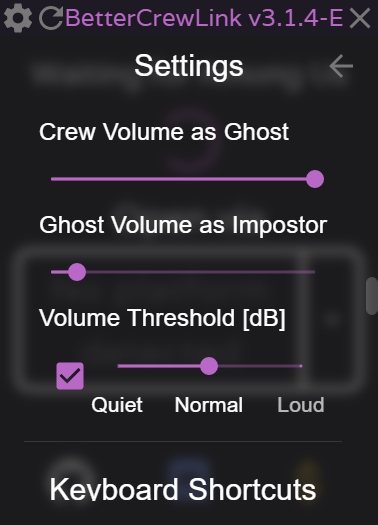

# BetterCrewLink - Anti Mic Spammer Edition (Beta)

## :arrow_down_small: Download Link :arrow_down_small:

Installer Link: https://github.com/tejashah88/BetterCrewLink/releases/download/v3.1.4-E/Better-CrewLink.Setup.3.1.4-E_20251108.exe

## Introduction

This is a modded version of BetterCrewLink by OhMyGuus that adds voice volume normalization: it softens loud voices (to protect against mic spammers). If you just want the regular version of BetterCrewLink, please go here: https://github.com/OhMyGuus/BetterCrewLink.

To use it, go to Settings (the :gear: icon on top-left), scroll down to "Player Volume Tweaks" and enable it. The slider adjusts the maximum incoming volume from the other players in decibels (dB). Refer to the chart below for a [quick conversion chart](#decibel-to-volume-conversion-chart) between decibels and volume amount.



## Decibel to Volume Conversion Chart

| Decibels (dB) | Volume (%) |
| ------------: | ---------: |
|             0 |     100.0% |
|            -6 |      50.0% |
|           -12 |      25.0% |
|           -18 |      12.5% |
|           -24 |       6.3% |
|           -30 |       3.2% |
|           -36 |       1.6% |
|           -42 |       0.8% |
|           -48 |       0.4% |
|           -54 |       0.2% |
|           -60 |       0.1% |

## How does it work

See this repository for more information: https://github.com/tejashah88/voice-chat-volume-norm

## Developer Notes
To work on this project, you'll need the latest version of Node 16, since Electron depends on it. I recommend either using nvm (node version manager) or using Docker or a VM setup (what I did).

```bash
# Install dependencies
npm install -g yarn
yarn install

# Build for Windows & Linux respectively
yarn run dist
yarn run dist:linux
```
